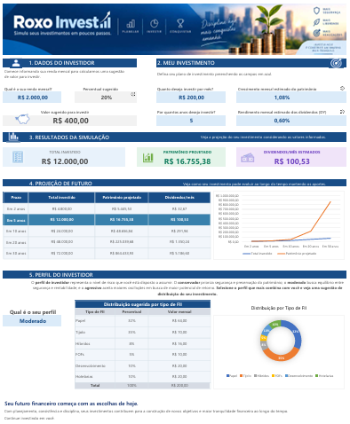

# 📊 Roxo Invest — Simulador de Investimentos em FIIs

## 📌 Sobre o projeto

O **Roxo Invest** é um simulador de investimentos em Fundos Imobiliários (FIIs), desenvolvido no **Microsoft Excel 365** como projeto prático da formação **Análise de Dados com Excel e IA**, da DIO.

O objetivo foi aplicar os conhecimentos adquiridos durante o curso na construção de uma ferramenta simples e visual, capaz de simular investimentos e apresentar ao usuário uma projeção dos resultados ao longo do tempo.

## ⚙️ Funcionalidades

A partir das informações preenchidas pelo usuário, o simulador permite:

- definir o valor do aporte mensal e o período do investimento;
- informar as premissas de crescimento do patrimônio e rendimento de dividendos (DY);
- calcular o **total investido**, **patrimônio projetado** e **dividendos mensais estimados**;
- visualizar projeções para **2, 5, 10, 20 e 30 anos**;
- selecionar entre os perfis **Conservador, Moderado e Agressivo**;
- visualizar uma sugestão de distribuição do investimento entre diferentes tipos de FIIs;
- acompanhar os resultados por meio de tabelas e gráficos.

## 🧮 Recursos do Excel aplicados

Durante o desenvolvimento foram utilizados recursos estudados no curso:

- **Excel 365**
- **Formatação de células e fontes** para organização visual da interface;
- **Tabelas** para estruturação dos dados;
- **Formatação condicional** para destacar informações automaticamente;
- **Validação de dados** para criação de listas de seleção;
- **SOMA** para cálculo de totais;
- **PROCV** para busca automática de dados de acordo com o perfil selecionado;
- **VF / FV (Valor Futuro)** para projeção do patrimônio ao longo do tempo;
- **Gráficos de linhas e rosca** para facilitar a análise e interpretação dos resultados.

## 📈 Resultado

O simulador foi estruturado para conduzir o usuário por uma sequência simples:

**Dados do investidor → Definição do investimento → Resultados → Projeção de futuro → Perfil do investidor**

Os cálculos e gráficos são atualizados de acordo com as informações inseridas, permitindo visualizar diferentes cenários de investimento em uma única planilha.

## 🖼️ Demonstração

## 💡 Aprendizados

Este projeto me permitiu aplicar, de forma prática, diferentes recursos do Excel em uma única solução.

Além de trabalhar com fórmulas, tabelas, validação de dados, formatação condicional e gráficos, pude perceber a importância de **organizar e apresentar os dados de forma clara**, facilitando a utilização da ferramenta e a interpretação dos resultados.

O desenvolvimento também contribuiu para ampliar minha compreensão sobre a utilização do Excel na criação de ferramentas para **análise, simulação e apoio à tomada de decisão**.

## 🛠️ Ferramentas utilizadas

- **Microsoft Excel 365**
- **GitHub**

## 👩‍💻 Autora

**Andreia da Silva Roxo**

Projeto desenvolvido durante a formação **Análise de Dados com Excel e IA — DIO**.
